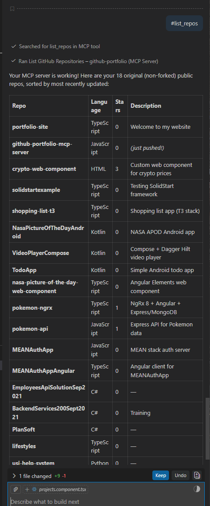

# GitHub Portfolio MCP Server

An MCP (Model Context Protocol) server that exposes tools for AI agents to query a GitHub user's public profile, repositories, languages, and README content.

## Tools

| Tool | Description |
|------|-------------|
| `list_repos` | List all public repositories with optional fork filtering and sorting |
| `get_repo_details` | Get detailed info about a repo including its full README |
| `get_languages` | Get language breakdown (with percentages) for a repository |
| `get_profile` | Get the GitHub user's public profile (bio, location, stats) |
| `search_repos` | Search repos by keyword across names, descriptions, and topics |
| `get_tech_stack_summary` | Aggregate languages and topics across all original repos |

## Resources

| Resource | URI | Description |
|----------|-----|-------------|
| Profile | `github://bdbrown4/profile` | Full GitHub profile JSON |
| README | `github://{owner}/{repo}/readme` | README content for any repo |

## Setup

```bash
npm install
npm run build
```

## Usage with Claude Desktop

Add to your `claude_desktop_config.json`:

```json
{
  "mcpServers": {
    "github-portfolio": {
      "command": "node",
      "args": ["C:/dev/github-portfolio-mcp-server/dist/index.js"]
    }
  }
}
```

## Usage with VS Code (GitHub Copilot)

Add to your `.vscode/mcp.json` or user settings:

```json
{
  "servers": {
    "github-portfolio": {
      "command": "node",
      "args": ["C:/dev/github-portfolio-mcp-server/dist/index.js"]
    }
  }
}
```

## Optional: Higher Rate Limits

Set a GitHub Personal Access Token to avoid the 60 req/hour unauthenticated limit:

```json
{
  "mcpServers": {
    "github-portfolio": {
      "command": "node",
      "args": ["C:/dev/github-portfolio-mcp-server/dist/index.js"],
      "env": {
        "GITHUB_TOKEN": "ghp_your_token_here"
      }
    }
  }
}
```

## Example

Here's the `list_repos` tool in action inside VS Code with GitHub Copilot, listing all 18 original (non-forked) public repos sorted by most recently updated:



## Development

```bash
npm run dev    # Watch mode — recompiles on change
npm run build  # One-time compile
npm start      # Run the server (stdio)
```
